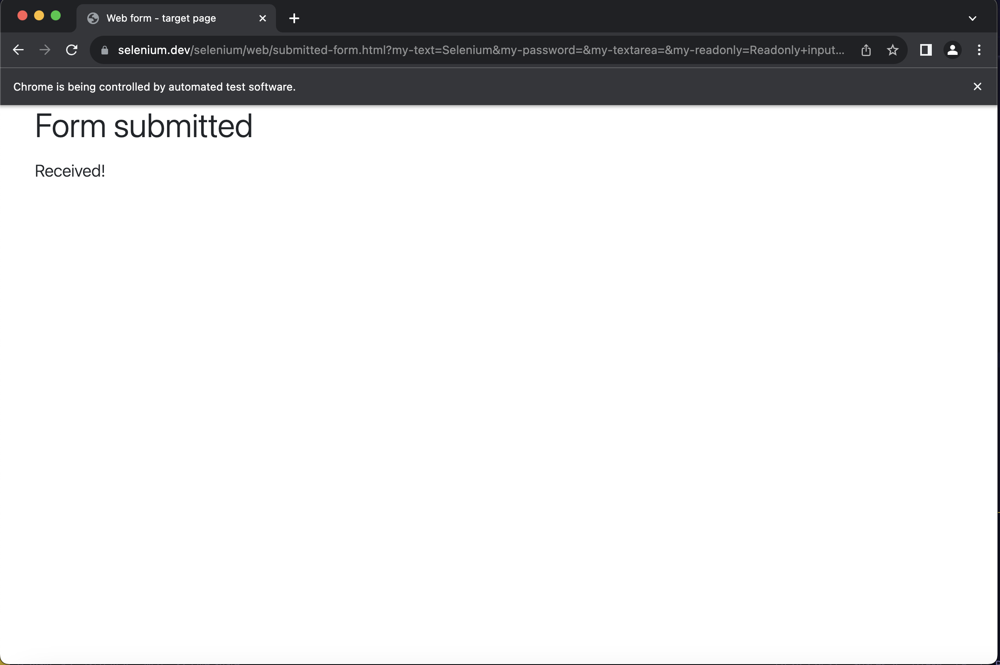
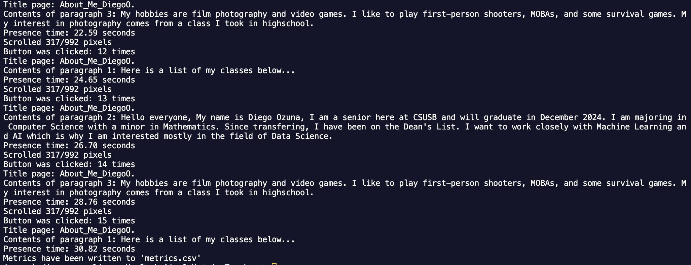
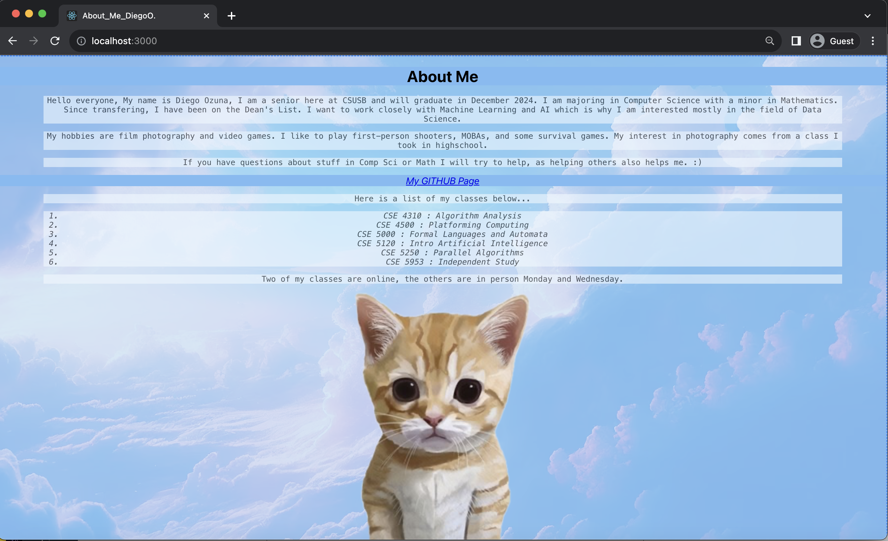

# Metric Tracker

PROVIDE OVERVIEW OF ASSIGNMENT HERE

Time spent: **1** hours spent in total

## Features

The following **required** features are completed:

- [x] Organize Github project for Assignment 2 (2 pt)
- [x] Transfer your About Me Page into a React App with screenshot of output in the Images folder(3 pt)
- [x] Set up Selenium (2 pt)
- [x] Write your first Selenium script with screenshot of output in the Images folder (4 pt)
- [x] Monitor at least 2 metrics using Selenium with screenshot of output in the Images folder (4 pt)

The following **bonus** features are implemented:

- [x] Saves metrics into csv file (1 pt)
- [x] Monitors at least 4 metrics (1 pt)
- [ ] DESCRIBE ANY OTHER FEATURES HERE.

## Screenshots

This is a small preview of what the CSV file has...  

Showing output out of first tutorial of Selenium  

Showing output out of metric_tracker  

Showing Assignment 1 being translated to React...  

## Notes:

The scroll metric is not truly accurate. Since we track a button (which is at the bottom of the screen), the driver will scroll to the bottom automatically and keep there.
