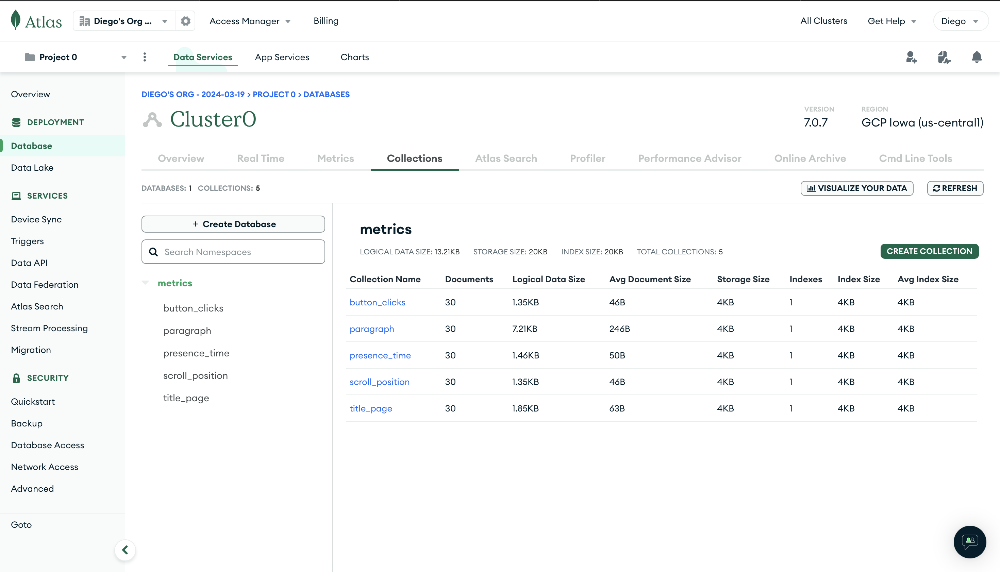
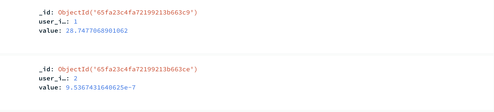

# Metric Tracker with Database
PROVIDE OVERVIEW OF ASSIGNMENT HERE
Time spent: **2.5** hours spent in total

## Features
The following **required** features are completed:
- [x] Organize Github projects for Assignment 3 (2 pts)
- [x] Complete SQL Mystery Walkthrough and take a screenshot or print to PDF the
webpage (2 pts)
- [x] Complete Interactive MongoDB Tutorial and take a screenshot or print to PDF
the webpage (2 pts)
- [x] Choose a SQL or NoSQL Database and set up a server (4 pts)
- [x] Modify your metric_tracker file so that the metrics are saved onto a database
(5 pts)
The following **bonus** features are implemented:
- [x] Retrieve values from the database (1 pt).
- [x] Create separate Tables (SQL) or Documents (NoSQL) for each metric and relate
them via user (2 pt).
- [x] Completed the challenge in SQL mastery

## Screenshot and/or Video Walkthrough
This was the mongoDB when first initialized...  

This was the mongoDB after it was filled with metrics  

This shows how user_id is connected to entries... 

This shows I did mongo tutorial  

This shows I did the tutorial for SQL...  

This shows I did the challenge in SQL tutorial... 

## Notes:
No notes this time around.
