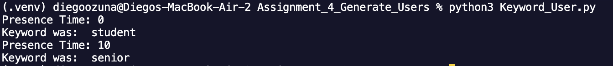
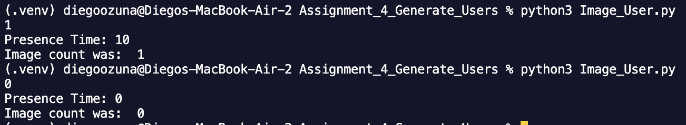
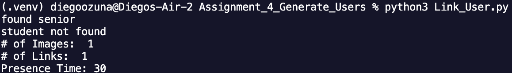
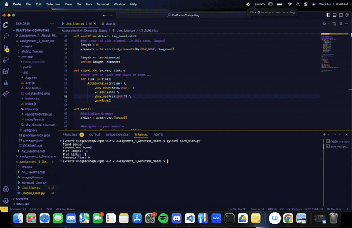
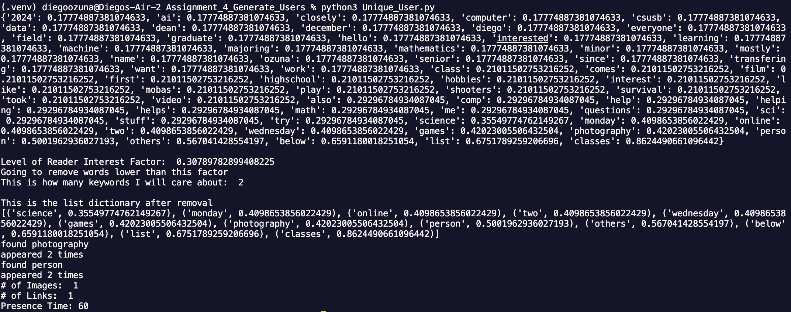

# Generate Users
PROVIDE OVERVIEW OF ASSIGNMENT HERE
Time spent: **NUMBER_HOURS_SPENT** hours spent in total
## Features
The following **required** features are completed:
- [x] Organize Github folders (2 pts)
- [x] Create a user with affinity towards keyword(s) and verify that it works (3
pts)
- [x] Create a user with affinity towards image(s) and verify that it works (3 pts)
- [x] Create a user with affinity towards links and verify that it works (3 pts)
- [x] Describe a user with unique affinities (1 pt)
- [x] Create a user with unique affinities and verify that it works (3 pts)
The following **bonus** features are implemented:
- [ ] Create a unique user with an affinity OUTSIDE of keywords, images, or links
(1.5 pt)
- [ ] Uploaded files for a unique user BOTH in javascript and python (1.5 pt)
- [ ] DESCRIBE ANY OTHER FEATURES HERE.
- [x] Unique_User is completely random to have variability. Can be used to generate more samples if needed.
## Screenshot and/or Video Walkthrough

Here is the output from Keyword_User.py

Here is the output from Image_User.py

Here is the output from Link_User.py

Here is the link user opening links...  

Here is the output from the Unique_User.py

## Notes:

<ul>
<li>Unique user has KEYWORD,LINK, and IMAGE user interactions.</li>
<li>Unique user utilizes tf-idf over the text found in the paragraphs, and displays the dictionary made from it.</li>
Note: PRIOR TO CONSTRUCTING TF-IDF, we remove stop words. This is because keywords would typically be other words aside from "the", "it", etc.
<li>Unique user has a random cut off bias to artificially replicate an interested/uninterested user</li>
<li>Unique user randomly selects a number between 1 to however many elements (links/images) are present.</li>
Again, with the purpose being to replicate the uniqueness of a user being interested/uninterested.
<li>Reward time remains the same between all user files.</li>
<li>Unique user also opens the link within a seperate tab.</li>
</ul>